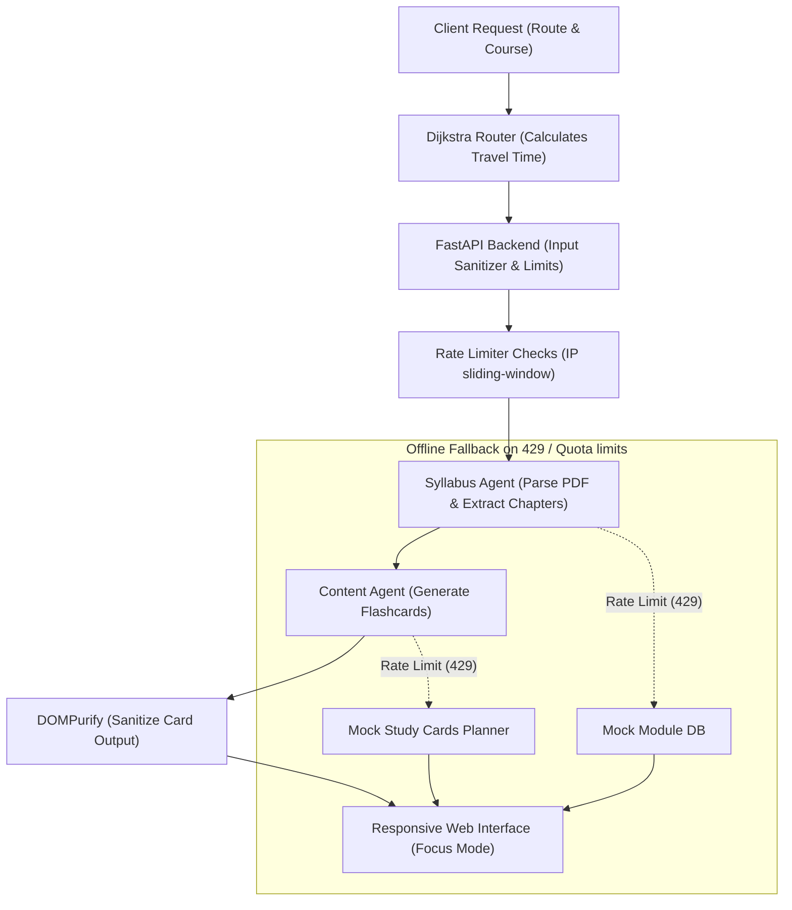

# Conscious Commute — Mumbai Student Study Cards Planner

<div align="center">

[](https://www.python.org/)
[](https://fastapi.tiangolo.com/)
[](https://github.com/google/generative-ai-python)
[](#-testing)
[](#-license)

**A responsive, security-hardened, phone-optimized study card planner for students commuting on the Mumbai local train network.**

</div>

---

## 📖 Introduction

**Conscious Commute** is a web application designed for students across all disciplines in Mumbai (Engineering, Finance, Commerce, Arts, Law, Management, etc.). It helps students utilize their daily local train commutes productively by generating bite-sized micro-study cards that fit exactly into their specific travel durations.

The application leverages the **Google Agent Development Kit (ADK)** to orchestrate a multi-agent workflow that parses course syllabi and structures learning cards matching commute time restrictions.

---

## ⚙️ Architecture Workflow

The diagram below shows the system flow, including Dijkstra path calculation, input sanitization, sequential agent execution, and the fail-safe offline fallback paths:



---

## ✨ Features

- **Interactive Railway Map**: Uses Leaflet.js to plot stations and calculate exact travel times across Western, Central, and Harbour lines.
- **Cross-Line Transfers**: Custom Dijkstra router calculates transfer paths at Dadar, Kurla, CSMT, Masjid, and Sandhurst Road, adjusting times for rush-hour peak transit delays (15% delay).
- **10 Core Subjects**: Broad syllabus integration spanning:
  - *Engineering*: Engineering Mathematics III, Data Structures, Signals and Systems, Engineering Mechanics
  - *Business & Commerce*: Corporate Finance, Financial Accounting, Marketing Management, Human Resource Management
  - *Economics & Law*: Macroeconomics, Business Law
- **Dynamic Module Selector**: Automatically parses PDF syllabi and extracts chapter/module lists on demand.
- **Fail-Safe Offline Mode**: Detects API rate limits (HTTP 429) or token exhaustion and seamlessly transitions to offline mock cards matching the selected course and module.
- **Responsive Layout**: Designed for both mobile devices (focusing on distraction-free index cards) and laptops (featuring interactive map views and a high-visibility Focus Mode zoom).

---

## 🛡️ Security Hardening

- **XSS Prevention**: Markdown-compiled HTML is sanitized using **DOMPurify** before rendering. Exception logs and warnings are rendered via safe `.textContent` nodes.
- **Input Validation**: Sanitizes inputs and caps field lengths at `100` characters to prevent ReDoS payloads.
- **Memory Protection**: Automatically evicts ADK agent session structures and sweeps expired rate limiter IP cache keys.
- **CORS Config**: Replaced wildcard CORS with strict, environment-driven allowed origins using `ALLOWED_ORIGINS`.
- **Fail-Loudly startup**: Asset mounting validates files on startup and crashes the app immediately if assets are missing.

---

## 📁 Project Structure

```text
conscious-commute/
│
├── agents/                          # ADK agent definitions
│   ├── orchestrator.py              # Master agent sequencing sub-agents
│   ├── syllabus_agent.py            # Extracts topics from syllabus
│   └── content_agent.py             # Generates micro-study content
│
├── mcp_server/                      # MCP Server / Tool layer
│   └── tools/
│       ├── syllabus_parser.py       # PDF parsing tool (uses pypdf)
│       └── content_formatter.py     # Content formatting tool
│
├── data/                            # Static databases
│   ├── railway/
│   │   ├── western_line.json        # Western line station durations
│   │   ├── central_line.json        # Central line station durations
│   │   ├── harbour_line.json        # Harbour line station durations
│   │   └── station_coordinates.json # Geographic coordinates for Leaflet
│   └── syllabi/                     # Pre-loaded Mumbai syllabi (PDFs)
│
├── frontend/                        # Phone-optimized SPA web UI
│   ├── index.html                   # HTML Entrypoint (imports DOMPurify)
│   ├── css/
│   │   ├── main.css                 # Base styles & glassmorphic cards
│   │   └── mobile.css               # Mobile responsive styling overrides
│   └── js/
│       ├── map.js                   # Leaflet rendering
│       ├── railway.js               # Dijkstra path solver
│       ├── ui.js                    # UI handler with focus mode zoom
│       └── api.js                   # Client-side backend caller
│
├── backend/                         # FastAPI backend
│   ├── main.py                      # App entry point
│   ├── routes/
│   │   ├── generate.py              # POST /api/generate (sessions & rate limit)
│   │   └── syllabus.py              # GET /api/syllabi & GET /api/modules
│   ├── models/                      # Pydantic models (length constraints)
│   │   └── request.py
│   └── security/                    # Validation, Limiter, Keys
│       ├── rate_limiter.py          # Sliding-window IP cache rate limiter
│       ├── input_validator.py       # Regex inputs validation and sanitization
│       └── api_key_manager.py       # API Key health checks (raises HTTP 503)
│
├── utils/                           # Core utilities
│   ├── railway_graph.py             # Dijkstra solver (15% peak delay)
│   └── pdf_loader.py                # PDF reader
│
├── tests/                           # Unit tests & demo script
│   ├── test_input_validator.py      # Input length & character tests
│   ├── test_rate_limiter.py         # Memory leak & block tests
│   ├── test_routes.py               # Route integrations & mock fallback tests
│   └── test_*.py                    # Core agent tests
│
├── requirements.txt                 # Dependencies
└── README.md                        # This file
```

---

## 🚀 Getting Started

### 1. Prerequisites
Ensure you have `uv` installed. If not, follow the [installation guide](https://docs.astral.sh/uv/getting-started/installation/).

### 2. Configure Environment
Create a `.env` file in the root directory:
```env
GEMINI_API_KEY=your_gemini_api_key_from_google_ai_studio
ALLOWED_ORIGINS=http://127.0.0.1:8080,http://localhost:8080
```

### 3. Run Locally

Create the virtual environment, sync packages, and start the development server:
```bash
uv venv
source .venv/bin/activate  # On Windows: .venv\Scripts\activate
uv pip install -r requirements.txt
PYTHONPATH=. uv run uvicorn backend.main:app --host 127.0.0.1 --port 8080 --reload
```

Open `http://127.0.0.1:8080` in your web browser.

---

## 🧪 Testing

We use `pytest` to verify routing integrations, validation controls, agent structures, and memory-pruning rate limiters.

### Run Full Test Suite
```bash
PYTHONPATH=. uv run pytest
```
*(All 17 tests verify validation, CORS rules, mock fallbacks, session management, and Dijkstra shortest path times.)*

### Run CLI agent demo
Verify the ADK agent chain output directly in the console:
```bash
PYTHONPATH=. uv run python tests/cli_demo.py "Thane" "Dadar" "Data Structures" peak
```

---

## 🤝 Contributing

Contributions are welcome! Please follow these guidelines:
1. Fork the repository.
2. Create a feature branch (`git checkout -b feature/NewFeature`).
3. Commit your changes with descriptive messages.
4. Push your branch and open a Pull Request.

---

## 📄 License

This project is licensed under the MIT License. See the [LICENSE](LICENSE) file for details.
